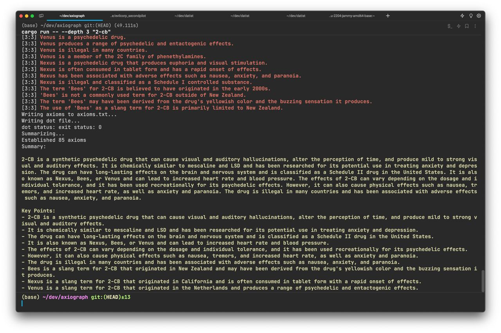
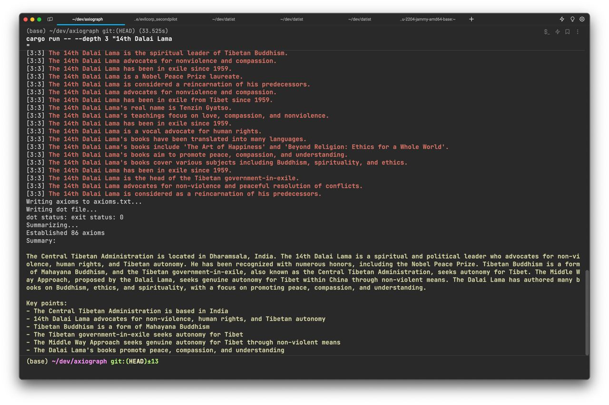
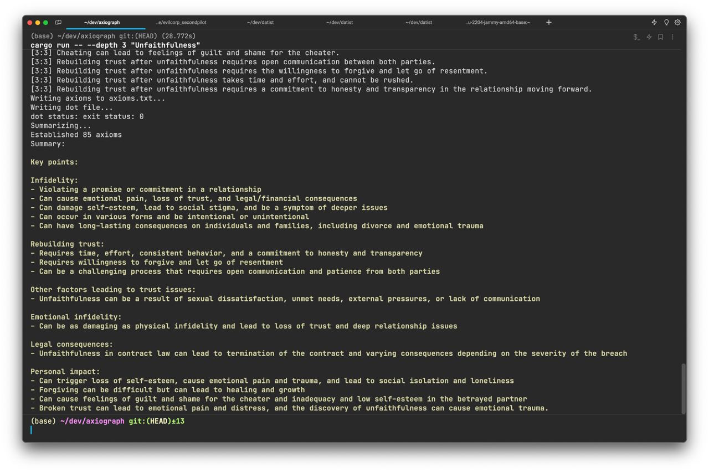

<h1 align="center">axiograph</h1>

<h5 align="center">A Rust program that visualizes the structure of complex axioms using GPT-4. Give it an axiom and a "depth", and it will generate a summary based on all established sub-axioms and a graph using graphviz. Explore the relationships between axioms and gain new insights with ease.</h5>

<div align="center">
  <a href="https://crates.io/crates/axiograph">
    crates.io
  </a>
  —
  <a href="https://github.com/19h/axiograph">
    Github
  </a>
</div>

<br />

```shell script
$ cargo install axiograph
$ TOKEN=gho_fooofoofoo axiograph --depth 3 "Why is the banana curved?"
```

##### Notes:

This project isn't powered by OpenAI's GPT-3, but rather by the EvilCorp SecondPilot API, which is a GPT-4-based API supporting developers.

##### Examples:

###### "2-cb"



###### "14th dalai lama"



###### "Unfaithfulness"



##### License:

This project is licensed under the MIT license.
